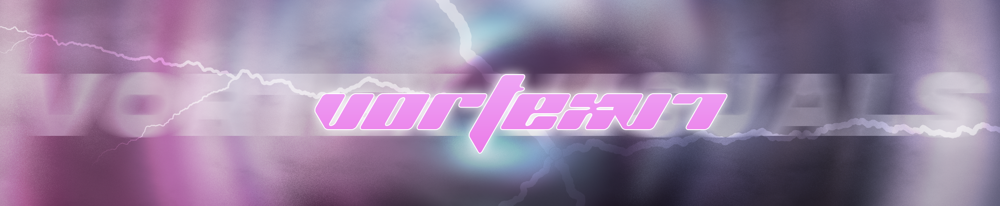

# Hello World!, I'm Ved, a Full Stack Developer 👋🏼:
🛜 currently working on my portfolio website (coming soon!) 👨🏼‍🎓 currently a student pursuing Enginnering in Computer Science & Engineering 👨🏼‍💻 working as a developer since 2020  🎬 just started out with my youtube channel <i>[Xiaomi Customs](https://www.youtube.com/@xiaomi_customz)</i>

                         

<picture>
  <source media="(prefers-color-scheme: dark)" srcset="https://raw.githubusercontent.com/VortexV7/VortexV7/output/github-snake-dark.svg" />
  <source media="(prefers-color-scheme: light)" srcset="https://raw.githubusercontent.com/VortexV7/VortexV7/output/github-snake.svg" />
  
</picture>

<h2>⚡️ Where to find me</h2>

<h2>❤️ Support Me</h2>

